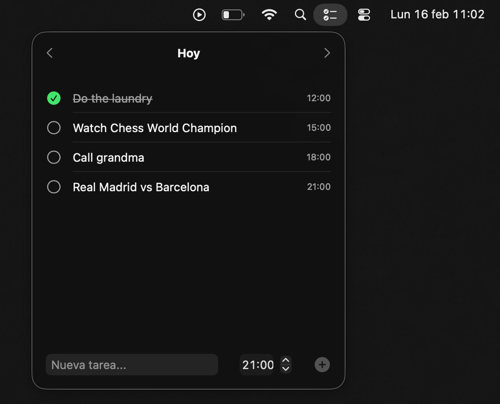

# Cue

A macOS menu bar app for quick daily task scheduling with timed notifications. Create tasks with a time, get reminded before they happen. Built for those busy days full of small events that don't belong in your calendar but you still need to remember.

## Features

- **Menu bar native** — Lives in your menu bar, no Dock icon, always one click away
- **Quick entry** — Add a task with a title and time in seconds
- **Smart reminders** — Get notified before each task
- **Launch at login** — Starts automatically with your Mac

## Requirements

- macOS 26.0+
- Xcode 26+

## Tech Stack

| Layer | Technology |
|---|---|
| UI | SwiftUI |
| Persistence | SwiftData |
| Notifications | UserNotifications |
| Launch at Login | ServiceManagement |

Zero external dependencies. Built entirely with native Apple frameworks.

## Built with AI

This project was built in collaboration with [Claude Code](https://claude.ai/code) as an experiment to explore the possibilities of native Apple development with AI agents.

## License

[MIT](LICENSE)
